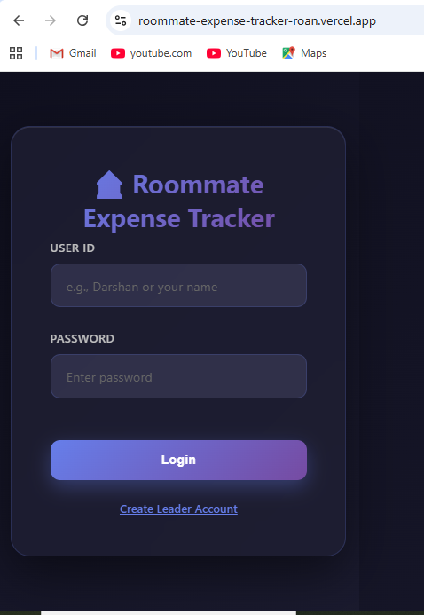
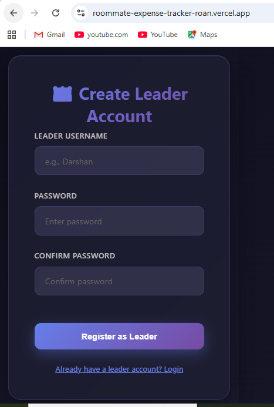
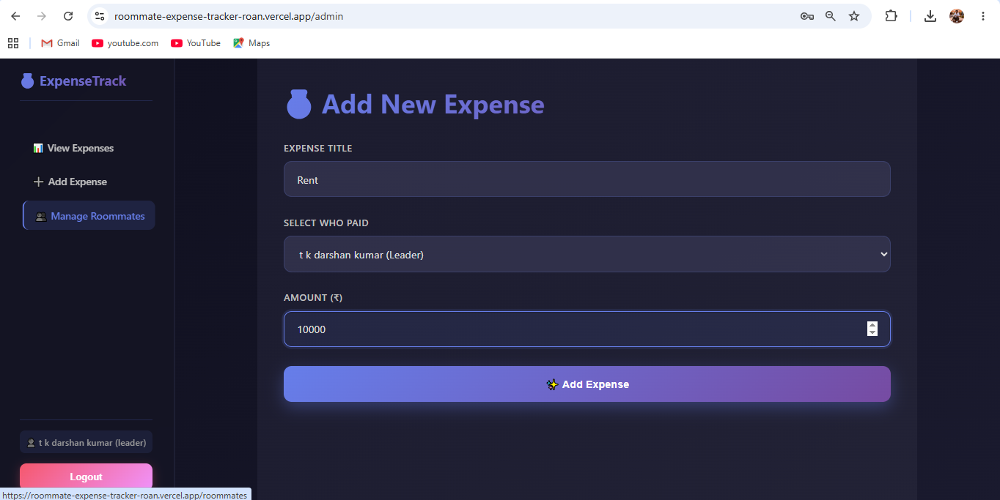
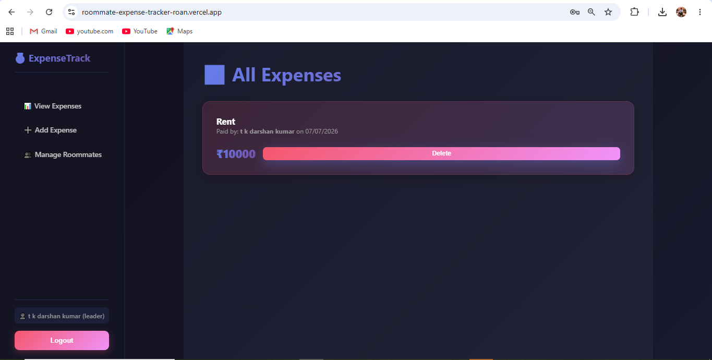
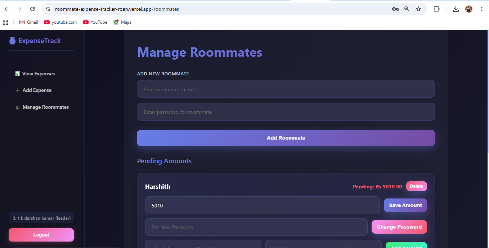
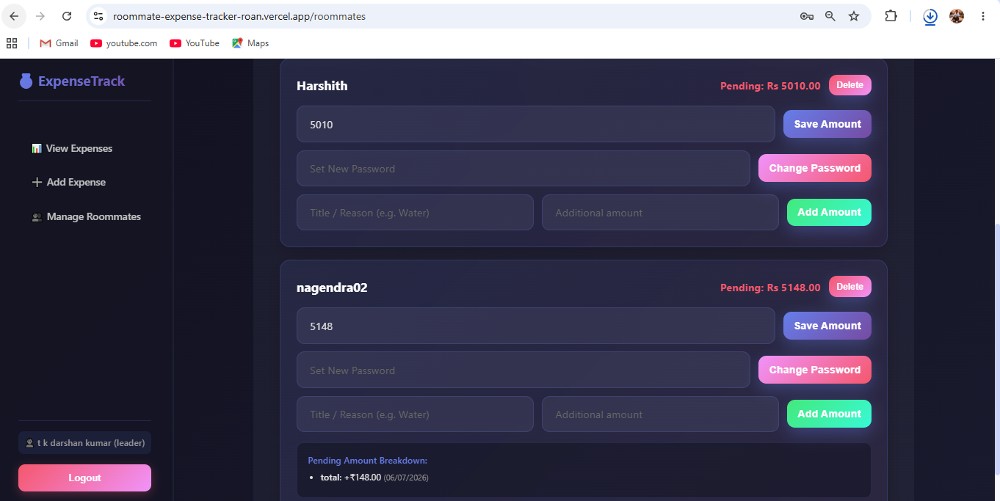
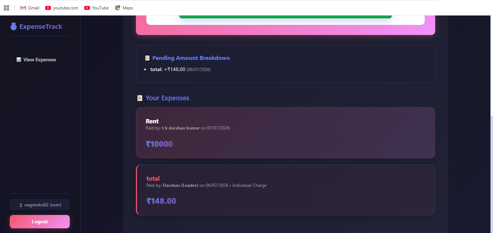
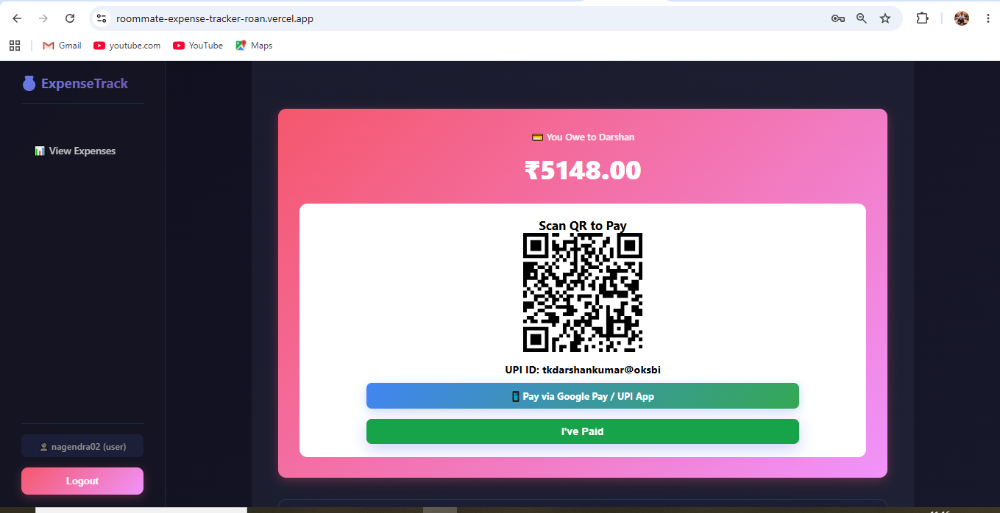

# 📸 Application Screenshots

## 🔐 Login Page

Leader login screen where the admin can securely access the application.

---

## 👑 Create Leader Account

New leaders can register and create their own roommate expense group.

---

## 💰 Add Expense

Leader can add expenses, select who paid, and enter the expense amount.

---

## 📋 View Expenses

Displays all recorded expenses with payment details and delete option for the leader.

---

## 👥 Manage Roommates

Leader can add roommates, change passwords, manage pending balances, and update individual amounts.

---

## 💳 Pending Amount

Leader can monitor pending balances for every roommate.

---

## 📊 Roommate Dashboard

Each roommate can view their personal pending amount and expense history.

---

## 📱 QR Code Payment

Roommates can pay their pending amount instantly by scanning the generated UPI QR code.